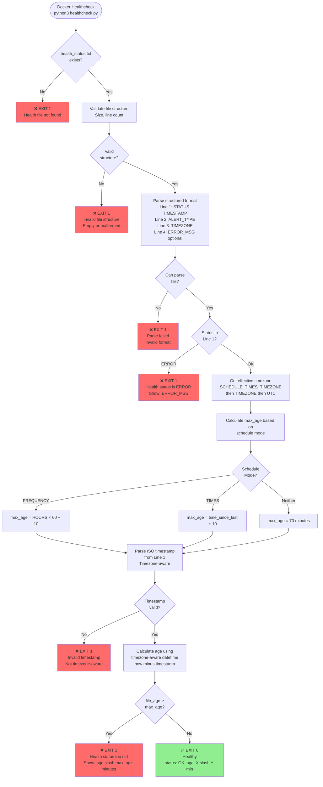
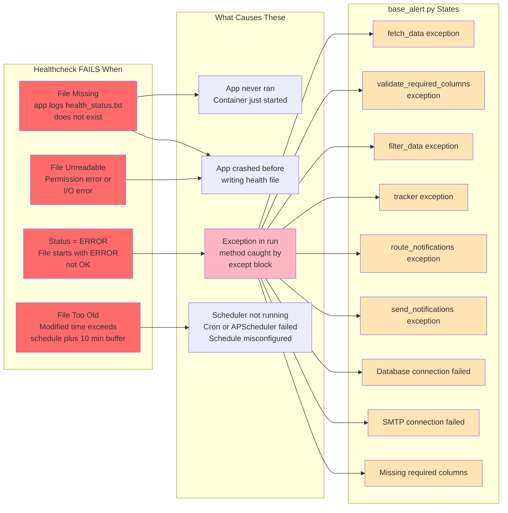
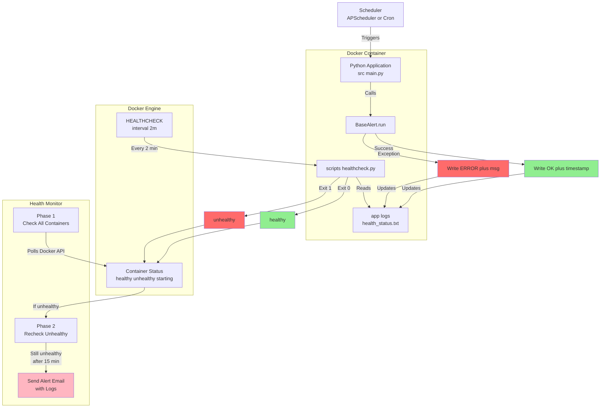
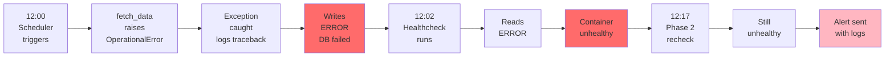
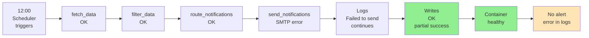
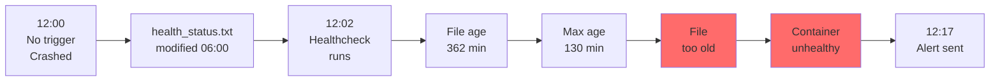

# Base Alert Flow Diagrams

## src/core/base_alert.py Workflow with Healthcheck Failures

*Shows the complete execution flow of the alert system's run() method, including all success paths (writing OK status) and failure paths (writing ERROR status with exception details)*

```mermaid
flowchart TD
    Start([alert.run<br/>called]) --> Init[Initialize run_time<br/>Log: RUN STARTED]
    
    Init --> TryBlock{Enter<br/>try block}
    
    TryBlock --> Step1[Step 1: Fetch Data<br/>df = self.fetch_data]
    
    Step1 --> FetchError{Fetch<br/>Exception?}
    FetchError -->|Yes| CatchBlock[Jump to except block]
    FetchError -->|No| CheckEmpty1{df.empty?}
    
    CheckEmpty1 -->|Yes| HealthOK1[Write: OK health_status.txt<br/>Return False]
    CheckEmpty1 -->|No| LogFetched[Log: Fetched N records]
    
    LogFetched --> Step2[Step 2: Validate Columns<br/>validate_required_columns]
    
    Step2 --> ValidateError{Validation<br/>Exception?}
    ValidateError -->|Yes| CatchBlock
    ValidateError -->|No| Step3[Step 3: Filter Data<br/>df_filtered = filter_data]
    
    Step3 --> FilterError{Filter<br/>Exception?}
    FilterError -->|Yes| CatchBlock
    FilterError -->|No| CheckEmpty2{df_filtered<br/>empty?}
    
    CheckEmpty2 -->|Yes| HealthOK2[Write: OK health_status.txt<br/>Return False]
    CheckEmpty2 -->|No| LogFiltered[Log: N records after filtering]
    
    LogFiltered --> Step4[Step 4: Filter Unsent<br/>df_unsent = tracker.filter_unsent_events]
    
    Step4 --> TrackerError{Tracker<br/>Exception?}
    TrackerError -->|Yes| CatchBlock
    TrackerError -->|No| CheckEmpty3{df_unsent<br/>empty?}
    
    CheckEmpty3 -->|Yes| HealthOK3[Write: OK health_status.txt<br/>Log: All previously sent<br/>Return False]
    CheckEmpty3 -->|No| LogUnsent[Log: N new records to notify]
    
    LogUnsent --> Step5[Step 5: Route Notifications<br/>jobs = route_notifications]
    
    Step5 --> RouteError{Route<br/>Exception?}
    RouteError -->|Yes| CatchBlock
    RouteError -->|No| LogJobs[Log: Created N notification jobs]
    
    LogJobs --> Step6[Step 6: Send Notifications<br/>success = _send_notifications]
    
    Step6 --> SendLoop[Loop through jobs]
    
    SendLoop --> SendJob[Send job idx/total]
    SendJob --> SendError{Send<br/>Exception?}
    SendError -->|Yes| LogSendFail[Log: Failed to send<br/>Continue to next job]
    SendError -->|No| SendSuccess[Log: Sent successfully<br/>Track sent keys]
    
    LogSendFail --> MoreJobs{More<br/>jobs?}
    SendSuccess --> MoreJobs
    
    MoreJobs -->|Yes| SendLoop
    MoreJobs -->|No| MarkSent[Mark events as sent<br/>tracker.mark_as_sent]
    
    MarkSent --> HealthOK4[Write: OK health_status.txt<br/>Return success]
    
    HealthOK1 --> Finally
    HealthOK2 --> Finally
    HealthOK3 --> Finally
    HealthOK4 --> Finally
    
    CatchBlock --> LogException[Log: exception<br/>with full traceback]
    LogException --> HealthERROR[Write: ERROR health_status.txt<br/>Include error message<br/>Return False]
    
    HealthERROR --> Finally
    
    Finally[Finally Block:<br/>Log: RUN COMPLETE]
    Finally --> End([End])
    
    style HealthOK1 fill:#90EE90
    style HealthOK2 fill:#90EE90
    style HealthOK3 fill:#90EE90
    style HealthOK4 fill:#90EE90
    style HealthERROR fill:#FF6B6B
    style CatchBlock fill:#FFB6C1
    style FetchError fill:#FFE4B5
    style ValidateError fill:#FFE4B5
    style FilterError fill:#FFE4B5
    style TrackerError fill:#FFE4B5
    style RouteError fill:#FFE4B5
    style SendError fill:#FFE4B5
```

## Healthcheck Failure Conditions Diagram

*Shows the healthcheck script's validation logic: file existence → structure validation → structured parsing → status check (OK/ERROR) → timezone-aware age calculation → pass/fail determination*

## Conditions That Cause Healthcheck Failure

*Maps the four healthcheck failure reasons (file missing, unreadable, ERROR status, too old) to their root causes in the alert application and infrastructure*

## Complete Integration Flow

*End-to-end system view: scheduler triggers alert application → writes health status file → Docker healthcheck reads file → reports to Docker Engine → health monitor detects unhealthy containers → Phase 2 recheck → sends email alerts*

## Example Error Scenarios

### Scenario 1: Database Down
*Alert application encounters database connection error → writes ERROR to health file → healthcheck detects ERROR status → container marked unhealthy → Phase 2 confirms and sends alert*

### Scenario 2: SMTP Failed
*Alert application runs successfully but SMTP fails during notification sending → still writes OK (partial success) → container stays healthy → no external alert sent but error logged*

### Scenario 3: Scheduler Not Running
*Scheduler crashes and stops triggering alert application → health file becomes stale (6 hours old) → healthcheck detects file age exceeds maximum → container marked unhealthy → alert sent*

## Summary Table

| Condition | health_status.txt | Healthcheck Result | Container Status | Alert Sent After 15 Min |
|-----------|-------------------|-------------------|------------------|------------------------|
| **App runs successfully, no data** | `OK 12:00:00` | Exit 0 | healthy | No |
| **App runs successfully, sent emails** | `OK 12:05:00` | Exit 0 | healthy | No |
| **Database connection failed** | `ERROR 12:00:00` `ERROR_MSG: Connection refused` | Exit 1 | unhealthy | Yes (with logs) |
| **Missing required columns** | `ERROR 12:00:00` `ERROR_MSG: Missing columns` | Exit 1 | unhealthy | Yes (with logs) |
| **Scheduler not running** | `OK 06:00:00` (old) | Exit 1 (too old) | unhealthy | Yes (with logs) |
| **File doesn't exist** | (missing) | Exit 1 | unhealthy | Yes (with logs) |
| **File unreadable** | (permission error) | Exit 1 | unhealthy | Yes (with logs) |
| **App crashed before writing** | (missing or old) | Exit 1 | unhealthy | Yes (with logs) |

These diagrams make it crystal clear:
1. **When healthchecks pass** (green paths)
2. **When healthchecks fail** (red paths)
3. **What exceptions in `base_alert.py` lead to failures**
4. **How the monitoring system responds**
