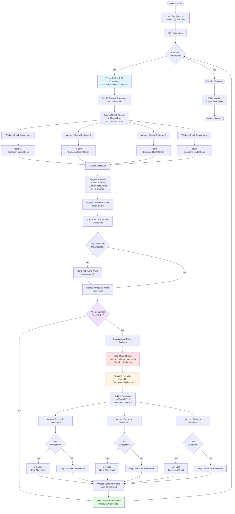
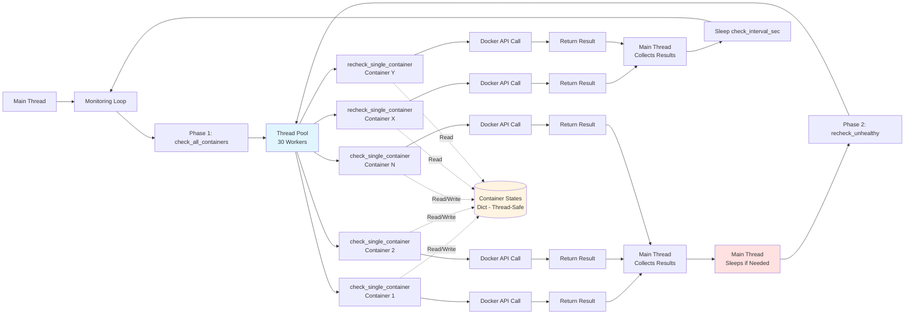

# Multi-Project Docker Health Monitor

A robust, production-ready Docker container health monitoring system that tracks containers across multiple projects and sends intelligent email alerts when issues are detected.

## Overview

This monitor watches all Docker containers with healthchecks across multiple docker-compose projects, implements a two-phase verification pattern to avoid false positives, and sends contextual email alerts with actionable troubleshooting steps.

**Key Features:**
- **Two-phase health verification** - confirms issues before alerting
- **Concurrent health checks** using ThreadPoolExecutor (30 workers)
- **Project-aware alerting** - groups containers by project with context
- **Thread-safe** state management
- **Graceful shutdown** handling for clean stops
- **Zero false positives** - only alerts after confirmation
- **Scales efficiently** to any number of containers
- **Cross-platform** - works on Mac, Ubuntu, and other Linux distributions

## Architecture

### High-Level Two-Phase Flow


### Detailed Phase 1 Flow


### Detailed Phase 2 Flow


### Thread Pool Usage Pattern


## Installation

### Prerequisites

- Python 3.7+
- Docker Engine with API access
- SMTP server credentials for email alerts

### Setup

**For Ubuntu/Linux:**
```bash
sudo mkdir -p /srv/repos/_docker_monitoring/logs
cd /srv/repos/_docker_monitoring
```

**For Mac/Development:**
```bash
mkdir -p ~/dev/alerts/_docker_monitoring/logs
cd ~/dev/alerts/_docker_monitoring
```

**Common steps:**

1. **Download the scripts:**
   - `docker_health_monitor.py` (main script)
   - `.env` (configuration file)

2. **Install dependencies:**
   ```bash
   pip3 install docker python-decouple
   ```

3. **Set permissions:**
   ```bash
   chmod +x docker_health_monitor.py
   ```

4. **Add healthcheck scripts to your projects** (see Container Healthcheck section)

## Configuration

Create a `.env` file in the same directory as `docker_health_monitor.py`:

```bash
# ============================================
# REQUIRED CONFIGURATION
# ============================================

# SMTP Configuration
SMTP_HOST=smtp.gmail.com
SMTP_PORT=587
SMTP_USER=your-email@gmail.com
SMTP_PASS=your-app-password

# Alert Recipients (comma-separated)
HEALTH_CHECK_ALERT_EMAILS=admin@example.com,ops@example.com

# ============================================
# OPTIONAL CONFIGURATION
# ============================================

# Server Identification
SERVER_NAME=Production Server

# Monitoring Intervals
HEALTH_CHECK_INTERVAL_SEC=30
WAIT_AND_CHECK_AGAIN_MIN=15

# Logging
HEALTH_CHECK_LOG_LINES=50

# Project-Specific Alert Routing
# Format: pattern1:email1,email2;pattern2:email3
CONTAINER_ALERT_ROUTING=passage-plan:maritime@example.com;vessel-cert:compliance@example.com
```

### Configuration Reference

| Variable | Required | Default | Description |
|----------|----------|---------|-------------|
| `SMTP_HOST` | **Yes** | - | SMTP server hostname |
| `SMTP_PORT` | No | 587 | SMTP server port (587=STARTTLS, 465=SSL) |
| `SMTP_USER` | **Yes** | - | SMTP username/email |
| `SMTP_PASS` | **Yes** | - | SMTP password or app-specific password |
| `HEALTH_CHECK_ALERT_EMAILS` | **Yes** | - | Comma-separated list of default alert recipients |
| `SERVER_NAME` | No | `Production` | Server identifier shown in alert emails |
| `HEALTH_CHECK_INTERVAL_SEC` | No | `30` | Seconds between health check cycles |
| `WAIT_AND_CHECK_AGAIN_MIN` | No | `15` | Minutes to wait before rechecking unhealthy containers |
| `HEALTH_CHECK_LOG_LINES` | No | `50` | Number of log lines to include in alert emails |
| `CONTAINER_ALERT_ROUTING` | No | - | Project-specific email routing (see below) |

### SMTP Port Configuration

**Port 587 (STARTTLS) - Recommended:**
- Most common and widely supported
- Uses STARTTLS encryption
- Works with Gmail, most email providers

```bash
SMTP_PORT=587
```

**Port 465 (SSL/TLS) - Alternative:**
- Direct SSL connection
- Some servers prefer this
- May be required for internal SMTP servers

```bash
SMTP_PORT=465
```

The script automatically detects which method to use based on the port number.

### Hardcoded Settings

These values are **hardcoded in the script** but use relative paths:

- **Log directory:** `./logs/` (relative to script location)
- **Log file:** `./logs/monitor.log`
- **Log file max size:** 10 MB
- **Log backup count:** 5 files
- **Thread pool workers:** 30

The script automatically creates the `logs/` directory if it doesn't exist.

## Container Healthchecks

Every container must have a healthcheck defined. The monitor **only tracks containers with healthchecks**.

### Adding Healthchecks to Your Projects

#### Step 1: Create `scripts/healthcheck.py` in Each Project

Create a file at `<project>/scripts/healthcheck.py`:

```python
#!/usr/bin/env python3
"""
Healthcheck script for Docker containers with flexible scheduling.
Supports both SCHEDULE_FREQUENCY_HOURS and SCHEDULE_TIMES modes.
"""
import os
import sys
from datetime import datetime, timedelta
from pathlib import Path


def main():
    """Main healthcheck logic."""
    health_file = Path("/app/logs/health_status.txt")
    
    # Check if health file exists
    if not health_file.exists():
        print("Health status file not found", file=sys.stderr)
        sys.exit(1)
    
    # Read health status
    try:
        content = health_file.read_text().strip()
        if not content.startswith("OK"):
            print(f"Health status is not OK: {content}", file=sys.stderr)
            sys.exit(1)
    except Exception as e:
        print(f"Cannot read health status: {e}", file=sys.stderr)
        sys.exit(1)
    
    # Calculate maximum age based on schedule mode
    max_age_minutes = calculate_max_age()
    
    # Check file modification time
    file_age_seconds = datetime.now().timestamp() - health_file.stat().st_mtime
    file_age_minutes = file_age_seconds / 60
    
    if file_age_minutes > max_age_minutes:
        print(
            f"Health status file is too old: {file_age_minutes:.1f} minutes "
            f"(max: {max_age_minutes:.1f} minutes)",
            file=sys.stderr
        )
        sys.exit(1)
    
    # All checks passed
    print(f"Healthy (file age: {file_age_minutes:.1f}/{max_age_minutes:.1f} minutes)")
    sys.exit(0)


def calculate_max_age() -> float:
    """Calculate maximum allowed age for health_status.txt based on schedule mode."""
    freq_hours = os.getenv('SCHEDULE_FREQUENCY_HOURS', '').strip()
    schedule_times = os.getenv('SCHEDULE_TIMES', '').strip()
    
    # Mode 1: Frequency-based (e.g., every 2 hours)
    if freq_hours:
        try:
            hours = float(freq_hours)
            return hours * 60 + 10  # Allow schedule interval + 10 minute buffer
        except (ValueError, TypeError):
            print(f"Invalid SCHEDULE_FREQUENCY_HOURS: {freq_hours}", file=sys.stderr)
            return 70  # Default fallback: 1 hour + 10 min buffer
    
    # Mode 2: Specific times (e.g., 12:00,18:00)
    elif schedule_times:
        try:
            return calculate_max_age_from_times(schedule_times)
        except Exception as e:
            print(f"Error calculating age from SCHEDULE_TIMES: {e}", file=sys.stderr)
            return 70
    
    # Mode 3: No schedule defined (default to hourly + buffer)
    else:
        print("Warning: Neither SCHEDULE_FREQUENCY_HOURS nor SCHEDULE_TIMES set", file=sys.stderr)
        return 70


def calculate_max_age_from_times(schedule_times: str) -> float:
    """Calculate maximum age based on SCHEDULE_TIMES."""
    now = datetime.now()
    time_list = [t.strip() for t in schedule_times.split(',')]
    scheduled_datetimes = []
    
    for time_str in time_list:
        try:
            hour, minute = map(int, time_str.split(':'))
            scheduled_today = now.replace(hour=hour, minute=minute, second=0, microsecond=0)
            scheduled_datetimes.append(scheduled_today)
            scheduled_yesterday = scheduled_today - timedelta(days=1)
            scheduled_datetimes.append(scheduled_yesterday)
        except (ValueError, IndexError) as e:
            print(f"Invalid time format '{time_str}': {e}", file=sys.stderr)
            continue
    
    if not scheduled_datetimes:
        print("No valid times found in SCHEDULE_TIMES", file=sys.stderr)
        return 70
    
    past_times = [dt for dt in scheduled_datetimes if dt <= now]
    if not past_times:
        past_times = sorted(scheduled_datetimes)
    
    most_recent = max(past_times)
    minutes_since = (now - most_recent).total_seconds() / 60
    return minutes_since + 10  # Add 10 minute buffer


if __name__ == "__main__":
    main()
```

#### Step 2: Update Your Dockerfile

Ensure these lines exist in your Dockerfile (typically after `COPY` commands):

```dockerfile
# Copy project structure including healthcheck
COPY scripts/ ./scripts/

# Make healthcheck script executable
RUN chmod +x /app/scripts/*.py

# Add healthcheck - interval depends on your schedule
HEALTHCHECK --interval=2m --timeout=10s --start-period=2m --retries=2 \
  CMD python3 /app/scripts/healthcheck.py
```

#### Step 3: Rebuild and Restart Containers
```bash
cd /path/to/your/project
docker compose build
docker compose up -d
```

### Healthcheck Configuration by Schedule Type

**For `SCHEDULE_TIMES` (specific times like 12:00,18:00):**
```dockerfile
HEALTHCHECK --interval=5m --timeout=10s --start-period=2m --retries=2 \
  CMD python3 /app/scripts/healthcheck.py
```

**For `SCHEDULE_FREQUENCY_HOURS=1` (hourly):**
```dockerfile
HEALTHCHECK --interval=2m --timeout=10s --start-period=2m --retries=2 \
  CMD python3 /app/scripts/healthcheck.py
```

**For `SCHEDULE_FREQUENCY_HOURS=0.25` (every 15 minutes):**
```dockerfile
HEALTHCHECK --interval=1m --timeout=10s --start-period=1m --retries=3 \
  CMD python3 /app/scripts/healthcheck.py
```

**For web applications (always running):**
```dockerfile
HEALTHCHECK --interval=30s --timeout=10s --start-period=60s --retries=3 \
  CMD curl -f http://localhost:8000/health || exit 1
```

### Verifying Healthchecks
```bash
# Check healthcheck status
docker ps

# Detailed health information
docker inspect <container-name> | grep -A 20 Health

# Test healthcheck manually
docker exec <container-name> python3 /app/scripts/healthcheck.py

# Watch healthcheck in real-time
watch -n 5 'docker ps --format "table {{.Names}}\t{{.Status}}"'
```

## Usage

### Running the Monitor

**Foreground (for testing):**
```bash
# Ubuntu/Linux
cd /srv/repos/_docker_monitoring
python3 docker_health_monitor.py

# Mac/Development
cd ~/dev/alerts/_docker_monitoring
python3 docker_health_monitor.py
```

You should see output like:
```
======================================================================
Multi-Project Docker Health Monitor initialized
Server: Production Server
Default alert recipients: admin@example.com, ops@example.com
Check interval: 30 seconds
Retry delay: 15.0 minutes
======================================================================
======================================================================
▶ MULTI-PROJECT DOCKER HEALTH MONITOR STARTED
======================================================================
```

**Background with nohup:**
```bash
nohup python3 docker_health_monitor.py > /dev/null 2>&1 &
```

**As a systemd service (Ubuntu/Linux - recommended for production):**

Create `/etc/systemd/system/docker-health-monitor.service`:

```ini
[Unit]
Description=Multi-Project Docker Health Monitor
After=docker.service
Requires=docker.service

[Service]
Type=simple
User=root
WorkingDirectory=/srv/repos/_docker_monitoring
ExecStart=/usr/bin/python3 /srv/repos/_docker_monitoring/docker_health_monitor.py
Restart=always
RestartSec=10
StandardOutput=journal
StandardError=journal

[Install]
WantedBy=multi-user.target
```

**Important:** If running as non-root user:
```bash
# Add user to docker group
sudo usermod -aG docker your-username

# Then use this in the service file
User=your-username
```

Enable and start:
```bash
sudo systemctl daemon-reload
sudo systemctl enable docker-health-monitor
sudo systemctl start docker-health-monitor
```

Check status:
```bash
sudo systemctl status docker-health-monitor
sudo journalctl -u docker-health-monitor -f
```

### Viewing Logs
```bash
# Real-time monitoring (from script directory)
tail -f logs/monitor.log

# View recent activity
tail -100 logs/monitor.log

# Search for specific container
grep "container-name" logs/monitor.log

# View all status changes
grep "→" logs/monitor.log
```

## How It Works

### Two-Phase Verification Pattern

The monitor uses a two-phase approach to eliminate false positives:

**Phase 1: Initial Health Checks (Concurrent)**
1. Monitor fetches all running Docker containers
2. Submits each container to thread pool (max 30 concurrent checks)
3. Workers call `get_container_health()` via Docker API
4. Results are categorized:
   - **No change:** Update last_check timestamp only
   - **Became unhealthy:** Add to retry queue (includes unknown→unhealthy, starting→unhealthy, healthy→unhealthy)
   - **Became healthy:** Add to immediate alert queue (recovery notification)

**Transition: Main Thread Sleep**
- If retry queue is empty: Sleep for `check_interval_sec` (30s default), then restart loop
- If retry queue has containers: Log count, then sleep for `wait_and_check_again_min` (15 min default)
- Sleep is interruptible every 1 second to allow graceful shutdown

**Phase 2: Recheck Unhealthy (Concurrent)**
1. Submit all queued containers to thread pool for recheck
2. Workers call `recheck_single_container()` via Docker API
3. For each result:
   - **Still unhealthy:** Fetch logs, send alert email
   - **Now healthy:** Log recovery, update state, no alert
   - **Not found:** Send not_found alert

**After Phase 2:**
- Sleep for `check_interval_sec` (30s)
- Return to Phase 1

### Why This Pattern Works

**Eliminates False Positives:**
- Transient failures during deployments won't trigger alerts
- Network hiccups are given time to resolve
- Container restarts are given time to complete
- Only persistent issues (lasting 15+ minutes) generate alerts

**Efficient Resource Usage:**
- Thread pool limits concurrent Docker API calls to 30
- Main thread sleeps during wait (no wasted CPU)
- Interruptible sleep allows clean shutdown
- Scales to hundreds of containers efficiently

**Simple and Reliable:**
- No complex background task scheduling
- No retry futures to track
- Single main loop is easy to reason about
- Thread-safe state management
- Works across platforms (Mac, Ubuntu, other Linux)

### Example Timeline
```
00:00 - Phase 1: Check 50 containers (concurrent)
00:05 - Results: 48 healthy, 2 unhealthy (app-1, db-1)
00:05 - Main thread sleeps for 15 minutes (interruptible)
00:20 - Phase 2: Recheck app-1 and db-1 (concurrent)
00:20 - Results: app-1 recovered, db-1 still unhealthy
00:20 - Actions: Log app-1 recovery, send alert for db-1 with logs
00:20 - Sleep for 30 seconds
00:20:30 - Return to Phase 1
```

## Project-Specific Routing

Route alerts to different teams based on container or project names:
```bash
# In .env
CONTAINER_ALERT_ROUTING=passage-plan:maritime@example.com;vessel-cert:compliance@example.com;hot-works:safety@example.com
```

**How it works:**
- Pattern matching against container name OR project name
- First match wins
- Falls back to `HEALTH_CHECK_ALERT_EMAILS` if no match
- Multiple recipients per pattern supported (comma-separated)

**Example:**
```bash
# Container: passage-plan-web-1
# Project: passage-plan
# Pattern: passage-plan
# Result: Email sent to maritime@example.com
```

## Alert Examples

### Critical Alert (Unhealthy Container)
```
Subject: CRITICAL!! CRITICAL: [passage-plan] passage-plan-web-1 - Health Status Changed

Docker Container Health Alert
==============================

Server:          Production Server
Project:         passage-plan
Container:       passage-plan-web-1
Status Change:   healthy → unhealthy
Severity:        CRITICAL
Time:            2025-12-15 14:23:45

Details:
--------
Container remained unhealthy after 15.0 minute(s).

Recent logs:

[2025-12-15 14:20:12] ERROR: Database connection failed
[2025-12-15 14:20:13] ERROR: Retrying in 5 seconds...
[2025-12-15 14:20:18] ERROR: Still cannot connect
...

Action Required:
----------------
1. Check container logs:
   docker logs passage-plan-web-1

2. Inspect container:
   docker inspect passage-plan-web-1

3. Restart container:
   docker restart passage-plan-web-1
   
   Or navigate to project and restart:
   cd /path/to/passage-plan
   docker compose restart

4. Check application health endpoint

5. Review recent code changes or deployments


Project Context:
----------------
Container name: passage-plan-web-1
Project name:   passage-plan
Status:         unhealthy

---
Automated alert from Multi-Project Docker Health Monitor
Server: Production Server
Monitoring all containers with healthchecks
```

### Recovery Alert
```
Subject: INFO INFO: [passage-plan] passage-plan-web-1 - Health Status Changed

Docker Container Health Alert
==============================

Server:          Production Server
Project:         passage-plan
Container:       passage-plan-web-1
Status Change:   unhealthy → healthy
Severity:        INFO
Time:            2025-12-15 14:25:30

Details:
--------
Container recovered to healthy status.

Action Required:
----------------
Monitor the situation and check logs for more information.
```

### Container Not Found Alert
```
Subject: ERROR! ERROR: [passage-plan] passage-plan-worker-1 - Health Status Changed

Docker Container Health Alert
==============================

Server:          Production Server
Project:         passage-plan
Container:       passage-plan-worker-1
Status Change:   healthy → not_found
Severity:        ERROR
Time:            2025-12-15 14:30:15

Details:
--------
Container is no longer running or has been removed.

Action Required:
----------------
1. Check if container is running:
   docker ps -a | grep passage-plan-worker-1

2. Navigate to project directory:
   cd /path/to/passage-plan

3. Check docker-compose status:
   docker compose ps

4. Restart services:
   docker compose up -d

5. Check docker-compose.yml configuration
```

## Troubleshooting

### Monitor Not Starting

**1. Check configuration loading:**
```bash
python3 -c "from decouple import config; print('SMTP_HOST:', config('SMTP_HOST')); print('EMAILS:', config('HEALTH_CHECK_ALERT_EMAILS'))"
```

**2. Verify Docker access:**
```bash
docker ps
# If this fails, you don't have Docker permissions
```

**3. Check Python dependencies:**
```bash
python3 -c "import docker; import decouple; print('Dependencies OK')"
```

### Containers Not Being Monitored

**Check if container has healthcheck:**
```bash
docker inspect <container-name> | grep -A 20 Health
```

**If no healthcheck found:**
- Add `scripts/healthcheck.py` to your project
- Update Dockerfile with HEALTHCHECK line
- Rebuild: `docker compose build`
- Restart: `docker compose up -d`

**If healthcheck exists but shows "starting" status:**
```bash
# Increase start_period in Dockerfile
HEALTHCHECK --start-period=5m ...

# Or check if healthcheck script has errors
docker exec <container> python3 /app/scripts/healthcheck.py
```

### Emails Not Sending

**Test SMTP connection (port 587 - STARTTLS):**
```bash
python3 << 'EOF'
import smtplib
from decouple import config

try:
    server = smtplib.SMTP(config('SMTP_HOST'), int(config('SMTP_PORT', 587)))
    server.starttls()
    server.login(config('SMTP_USER'), config('SMTP_PASS'))
    print('✓ SMTP connection successful (STARTTLS)')
    server.quit()
except Exception as e:
    print(f'✗ SMTP connection failed: {e}')
EOF
```

**Test SMTP connection (port 465 - SSL):**
```bash
python3 << 'EOF'
import smtplib
from decouple import config

try:
    server = smtplib.SMTP_SSL(config('SMTP_HOST'), int(config('SMTP_PORT', 465)))
    server.login(config('SMTP_USER'), config('SMTP_PASS'))
    print('✓ SMTP connection successful (SSL)')
    server.quit()
except Exception as e:
    print(f'✗ SMTP connection failed: {e}')
EOF
```

**Common SMTP issues:**
- `[SSL: WRONG_VERSION_NUMBER]` → Wrong port for connection type (try changing port 465↔587)
- `Authentication failed` → Wrong username/password, or app password required
- `Connection refused` → Wrong SMTP_HOST or firewall blocking

**For Gmail users:**
1. Enable 2-Factor Authentication
2. Generate App Password: https://myaccount.google.com/apppasswords
3. Use App Password in `SMTP_PASS` (not regular password)
4. Use `SMTP_PORT=587`

**For custom SMTP servers:**
- Contact your email admin for correct settings
- Port 587 (STARTTLS) is more common than 465 (SSL)
- Some servers require different authentication methods

### False Positives During Deployments

**Increase retry wait time:**
```bash
# In .env
WAIT_AND_CHECK_AGAIN_MIN=20
```

**Or improve healthcheck `start_period`:**
```dockerfile
HEALTHCHECK --start-period=5m ...
```

### Healthcheck Script Errors

**Test the healthcheck script:**
```bash
# Inside container
docker exec <container> python3 /app/scripts/healthcheck.py

# Check health file exists
docker exec <container> ls -lh /app/logs/health_status.txt

# Check health file content
docker exec <container> cat /app/logs/health_status.txt

# Check environment variables
docker exec <container> env | grep SCHEDULE
```

## Best Practices

### Healthcheck Design Principles

**Good healthcheck characteristics:**
- Checks actual application functionality
- Completes in < 1 second
- Has appropriate start_period for slow-starting apps
- Uses reasonable interval (1-5 minutes for scheduled tasks)
- Includes retry logic (retries: 2-3)

**Bad healthcheck characteristics:**
- Only checks if port is open
- Takes too long to execute (> 5 seconds)
- No start_period (fails during boot)
- Too frequent interval (< 30s for scheduled tasks)

### Alert Tuning

**For frequently restarting containers:**
```bash
WAIT_AND_CHECK_AGAIN_MIN=20
HEALTH_CHECK_INTERVAL_SEC=60
```

**For critical services:**
```bash
WAIT_AND_CHECK_AGAIN_MIN=5
HEALTH_CHECK_INTERVAL_SEC=15
```

**For development environments:**
```bash
WAIT_AND_CHECK_AGAIN_MIN=1  # Fast testing
HEALTH_CHECK_INTERVAL_SEC=60
```

### Production Deployment Checklist

- [ ] Test in staging environment first
- [ ] Start with longer retry delays (15-20 minutes)
- [ ] Monitor logs daily for first week
- [ ] Verify SMTP credentials work (test both ports if needed)
- [ ] Test with intentional container failure
- [ ] Set up systemd service for automatic restart (Ubuntu)
- [ ] Configure project-specific routing
- [ ] Add monitor email to allow-list
- [ ] Document alert response procedures
- [ ] Verify all containers have healthchecks

## Graceful Shutdown

The monitor handles `SIGTERM` and `SIGINT` signals properly:

**Shutdown behavior:**
1. Signal received (SIGTERM, SIGINT, or Ctrl+C)
2. `shutdown_requested` flag set
3. Current operation completes:
   - If in Phase 1: Finishes collecting results
   - If sleeping: Interrupts sleep within 1 second
   - If in Phase 2: Finishes rechecks and alerts
4. ThreadPoolExecutor shutdown initiated
5. Waits for in-flight Docker API calls
6. Exits cleanly

**The interruptible sleep ensures:**
- Quick response to shutdown signals
- No alerts lost during shutdown
- Clean exit without hanging

## FAQ

**Q: Does this work with Docker Swarm?**  
A: Yes, monitors all containers visible to Docker API.

**Q: Can I monitor containers without healthchecks?**  
A: No. Containers must have healthchecks defined. Monitor skips containers without them.

**Q: How many containers can this monitor?**  
A: Tested with 100+ containers. Scales efficiently with 30 concurrent workers.

**Q: What happens during deployments?**  
A: The 15-minute retry prevents false alerts. Containers that recover within retry window won't trigger alerts.

**Q: Can I get Slack notifications instead of email?**  
A: Yes, modify `send_alert_email()` method to call your webhook.

**Q: Why doesn't my container appear in monitoring?**  
A: Three common reasons:
1. No healthcheck defined in Dockerfile
2. Container just started (wait 30 seconds for first check)
3. Healthcheck script has errors (test manually)

**Q: Can I test without waiting 15 minutes?**  
A: Yes, temporarily set `WAIT_AND_CHECK_AGAIN_MIN=1` in .env

**Q: Does it work on Mac?**  
A: Yes! The script uses relative paths and works on Mac, Ubuntu, and other Linux distributions.

**Q: What's the difference between port 465 and 587?**  
A: Port 587 uses STARTTLS (most common), port 465 uses direct SSL. The script detects and uses the appropriate method automatically.

## Performance Characteristics

**CPU:**
- Idle: ~0-1%
- Phase 1: 5-15% (depends on container count)
- Phase 2: 2-10%

**Memory:**
- Base: ~50-80 MB
- Per container: ~1-2 MB
- 100 containers: ~150-250 MB total

**Disk:**
- Log files: Max 50 MB (10 MB × 5 rotated files)
- Relative to script location

**Timing (50 containers, 30 workers):**
- Phase 1: ~2-3 seconds
- Sleep: 15 minutes (configurable)
- Phase 2: ~1 second
- Total cycle: ~15 minutes 6 seconds

## Support

For issues:

1. Check logs: `tail -f logs/monitor.log` (from script directory)
2. Verify configuration: `python3 -c "from decouple import config; print(config('SMTP_HOST'))"`
3. Test SMTP: See Troubleshooting section (test both ports if needed)
4. Ensure healthchecks: `docker inspect <container> | grep -A 10 Health`
5. Check Docker permissions: `docker ps`

## Changes from Previous Versions

**Version 2.1 (Current):**
- Fixed `became_unhealthy` logic to trigger on `unknown→unhealthy` transitions
- Added interruptible sleep with 1-second intervals
- Fixed SMTP port handling (auto-detects 587 vs 465)
- Made log paths relative and cross-platform compatible
- Improved shutdown handling

**Version 2.0:**
- Initial two-phase verification pattern
- Thread pool for concurrent health checks
- Project-aware alerting

---

**Version:** 2.1  
**Last Updated:** December 2025  
**Python Version:** 3.7+  
**Docker API Version:** Compatible with Docker Engine 19.03+  
**Platforms:** Ubuntu, Mac, other Linux distributions
