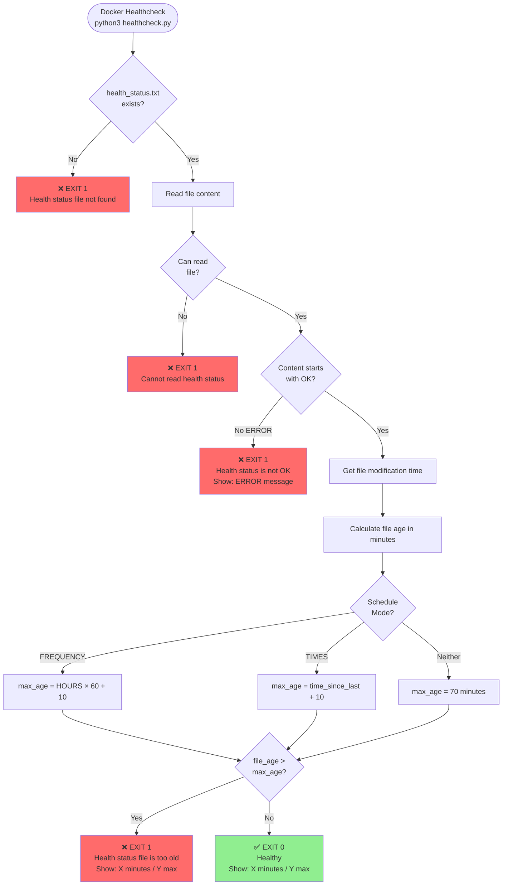
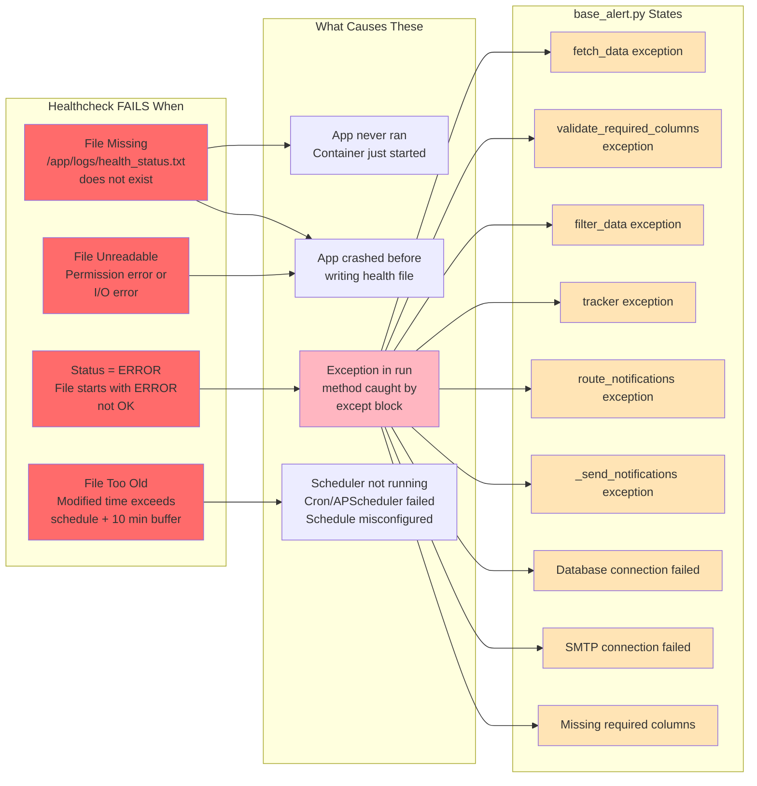

# Base Alert Flow Diagrams

## src/core/base_alert.py Workflow with Healthcheck Failures

Flow diagram showing the `src/core/base_alert.py` workflow with healthcheck failure conditions:

```mermaid
flowchart TD
    Start([alert.run<br/>called]) --> Init[Initialize run_time<br/>Log: RUN STARTED]
    
    Init --> TryBlock{Enter<br/>try block}
    
    TryBlock --> Step1[Step 1: Fetch Data<br/>df = self.fetch_data]
    
    Step1 --> FetchError{Fetch<br/>Exception?}
    FetchError -->|Yes| CatchBlock[Jump to except block]
    FetchError -->|No| CheckEmpty1{df.empty?}
    
    CheckEmpty1 -->|Yes| HealthOK1[Write: OK health_status.txt<br/>Return False]
    CheckEmpty1 -->|No| LogFetched[Log: Fetched N records]
    
    LogFetched --> Step2[Step 2: Validate Columns<br/>validate_required_columns]
    
    Step2 --> ValidateError{Validation<br/>Exception?}
    ValidateError -->|Yes| CatchBlock
    ValidateError -->|No| Step3[Step 3: Filter Data<br/>df_filtered = filter_data]
    
    Step3 --> FilterError{Filter<br/>Exception?}
    FilterError -->|Yes| CatchBlock
    FilterError -->|No| CheckEmpty2{df_filtered<br/>empty?}
    
    CheckEmpty2 -->|Yes| HealthOK2[Write: OK health_status.txt<br/>Return False]
    CheckEmpty2 -->|No| LogFiltered[Log: N records after filtering]
    
    LogFiltered --> Step4[Step 4: Filter Unsent<br/>df_unsent = tracker.filter_unsent_events]
    
    Step4 --> TrackerError{Tracker<br/>Exception?}
    TrackerError -->|Yes| CatchBlock
    TrackerError -->|No| CheckEmpty3{df_unsent<br/>empty?}
    
    CheckEmpty3 -->|Yes| HealthOK3[Write: OK health_status.txt<br/>Log: All previously sent<br/>Return False]
    CheckEmpty3 -->|No| LogUnsent[Log: N new records to notify]
    
    LogUnsent --> Step5[Step 5: Route Notifications<br/>jobs = route_notifications]
    
    Step5 --> RouteError{Route<br/>Exception?}
    RouteError -->|Yes| CatchBlock
    RouteError -->|No| LogJobs[Log: Created N notification jobs]
    
    LogJobs --> Step6[Step 6: Send Notifications<br/>success = _send_notifications]
    
    Step6 --> SendLoop[Loop through jobs]
    
    SendLoop --> SendJob[Send job idx/total]
    SendJob --> SendError{Send<br/>Exception?}
    SendError -->|Yes| LogSendFail[Log: Failed to send<br/>Continue to next job]
    SendError -->|No| SendSuccess[Log: Sent successfully<br/>Track sent keys]
    
    LogSendFail --> MoreJobs{More<br/>jobs?}
    SendSuccess --> MoreJobs
    
    MoreJobs -->|Yes| SendLoop
    MoreJobs -->|No| MarkSent[Mark events as sent<br/>tracker.mark_as_sent]
    
    MarkSent --> HealthOK4[Write: OK health_status.txt<br/>Return success]
    
    HealthOK1 --> Finally
    HealthOK2 --> Finally
    HealthOK3 --> Finally
    HealthOK4 --> Finally
    
    CatchBlock --> LogException[Log: exception<br/>with full traceback]
    LogException --> HealthERROR[Write: ERROR health_status.txt<br/>Include error message<br/>Return False]
    
    HealthERROR --> Finally
    
    Finally[Finally Block:<br/>Log: RUN COMPLETE]
    Finally --> End([End])
    
    style HealthOK1 fill:#90EE90
    style HealthOK2 fill:#90EE90
    style HealthOK3 fill:#90EE90
    style HealthOK4 fill:#90EE90
    style HealthERROR fill:#FF6B6B
    style CatchBlock fill:#FFB6C1
    style FetchError fill:#FFE4B5
    style ValidateError fill:#FFE4B5
    style FilterError fill:#FFE4B5
    style TrackerError fill:#FFE4B5
    style RouteError fill:#FFE4B5
    style SendError fill:#FFE4B5
```



## Healthcheck Failure Conditions Diagram

Here's a focused diagram showing when healthcheck will **FAIL**:



## Conditions That Cause Healthcheck Failure



## Complete Integration Flow

```mermaid
flowchart TD
    subgraph Container[Docker Container]
        App[Python Application<br/>src/main.py]
        Alert[BaseAlert.run]
        Health[/app/logs/<br/>health_status.txt]
        HCScript[scripts/healthcheck.py]
    end
    
    subgraph Docker[Docker Engine]
        HealthCheck[HEALTHCHECK<br/>--interval=2m]
        Status[Container Status:<br/>healthy/unhealthy/starting]
    end
    
    subgraph Monitor[Health Monitor]
        Phase1[Phase 1:<br/>Check All Containers]
        Phase2[Phase 2:<br/>Recheck Unhealthy]
        Email[Send Alert Email<br/>with Logs]
    end
    
    Schedule[Scheduler<br/>APScheduler/Cron] -->|Triggers| App
    App -->|Calls| Alert
    
    Alert -->|Success| WriteOK[Write: OK + timestamp]
    Alert -->|Exception| WriteERROR[Write: ERROR + msg]
    
    WriteOK -->|Updates| Health
    WriteERROR -->|Updates| Health
    
    HealthCheck -->|Every 2 min| HCScript
    HCScript -->|Reads| Health
    
    HCScript -->|Exit 0| Healthy[healthy]
    HCScript -->|Exit 1| Unhealthy[unhealthy]
    
    Healthy --> Status
    Unhealthy --> Status
    
    Phase1 -->|Polls Docker API| Status
    Status -->|If unhealthy| Phase2
    Phase2 -->|Still unhealthy<br/>after 15 min| Email
    
    style WriteOK fill:#90EE90
    style WriteERROR fill:#FF6B6B
    style Healthy fill:#90EE90
    style Unhealthy fill:#FF6B6B
    style Email fill:#FFB6C1
```

## Example Error Scenarios

```mermaid
flowchart TD
    subgraph Scenario1[Scenario 1: Database Down]
        S1A[12:00 - Scheduler triggers]
        S1B[fetch_data raises<br/>psycopg2.OperationalError]
        S1C[Exception caught<br/>logs full traceback]
        S1D[Writes: ERROR<br/>Database connection failed]
        S1E[12:02 - Healthcheck runs]
        S1F[Reads: ERROR]
        S1G[Container: unhealthy]
        S1H[12:17 - Phase 2 recheck]
        S1I[Still: unhealthy]
        S1J[Alert sent with logs]
    end
    
    subgraph Scenario2[Scenario 2: SMTP Failed]
        S2A[12:00 - Scheduler triggers]
        S2B[fetch_data: OK]
        S2C[filter_data: OK]
        S2D[route_notifications: OK]
        S2E[_send_notifications<br/>SMTP error in loop]
        S2F[Logs: Failed to send<br/>BUT continues]
        S2G[Writes: OK<br/>partial success]
        S2H[Container: healthy]
        S2I[No alert sent<br/>but error in logs]
    end
    
    subgraph Scenario3[Scenario 3: Scheduler Not Running]
        S3A[12:00 - No trigger<br/>Scheduler crashed]
        S3B[health_status.txt<br/>last modified: 06:00]
        S3C[12:02 - Healthcheck runs]
        S3D[File age: 362 minutes]
        S3E[Max age: 130 minutes<br/>FREQUENCY_HOURS=2]
        S3F[File too old]
        S3G[Container: unhealthy]
        S3H[12:17 - Alert sent]
    end
    
    S1A --> S1B --> S1C --> S1D --> S1E --> S1F --> S1G --> S1H --> S1I --> S1J
    S2A --> S2B --> S2C --> S2D --> S2E --> S2F --> S2G --> S2H --> S2I
    S3A --> S3B --> S3C --> S3D --> S3E --> S3F --> S3G --> S3H
    
    style S1D fill:#FF6B6B
    style S1G fill:#FF6B6B
    style S1J fill:#FFB6C1
    style S2G fill:#90EE90
    style S2H fill:#90EE90
    style S2I fill:#FFE4B5
    style S3F fill:#FF6B6B
    style S3G fill:#FF6B6B
```



## Summary Table

| Condition | health_status.txt | Healthcheck Result | Container Status | Alert Sent After 15 Min |
|-----------|-------------------|-------------------|------------------|------------------------|
| **App runs successfully, no data** | `OK 12:00:00` | Exit 0 | healthy | No |
| **App runs successfully, sent emails** | `OK 12:05:00` | Exit 0 | healthy | No |
| **Database connection failed** | `ERROR 12:00:00`<br/>`ERROR_MSG: Connection refused` | Exit 1 | unhealthy | Yes (with logs) |
| **Missing required columns** | `ERROR 12:00:00`<br/>`ERROR_MSG: Missing columns` | Exit 1 | unhealthy | Yes (with logs) |
| **Scheduler not running** | `OK 06:00:00` (old) | Exit 1 (too old) | unhealthy | Yes (with logs) |
| **File doesn't exist** | (missing) | Exit 1 | unhealthy | Yes (with logs) |
| **File unreadable** | (permission error) | Exit 1 | unhealthy | Yes (with logs) |
| **App crashed before writing** | (missing or old) | Exit 1 | unhealthy | Yes (with logs) |

These diagrams make it crystal clear:
1. **When healthchecks pass** (green paths)
2. **When healthchecks fail** (red paths)
3. **What exceptions in `base_alert.py` lead to failures**
4. **How the monitoring system responds**

